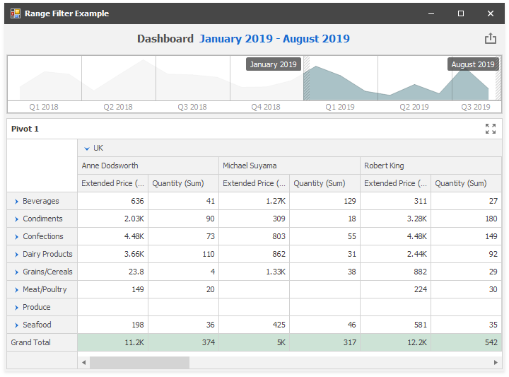

<!-- default file list -->
*Files to look at*:

* [Form1.cs](./CS/Dashboard_CreateRangeFilter/Form1.cs) (VB: [Form1.vb](./VB/Dashboard_CreateRangeFilter/Form1.vb))
<!-- default file list end -->
# How to Bind the Range Filter Dashboard Item to Data at Runtime

This example demonstrates how to create the [Range Filter](https://docs.devexpress.com/Dashboard/15265) and bind it to data in code. In this example, the Range Filter dashboard item filters data displayed in the pivot table.

API in this example:

* [RangeFilterDashboardItem](https://docs.devexpress.com/Dashboard/DevExpress.DashboardCommon.RangeFilterDashboardItem) class
* [SimpleSeries](https://docs.devexpress.com/Dashboard/DevExpress.DashboardCommon.SimpleSeries) class
* [DateTimePeriod](https://docs.devexpress.com/Dashboard/DevExpress.DashboardCommon.DateTimePeriod) class
* [PivotDashboardItem](https://docs.devexpress.com/Dashboard/DevExpress.DashboardCommon.PivotDashboardItem) class
* [DashboardExcelDataSource](https://docs.devexpress.com/Dashboard/DevExpress.DashboardCommon.DashboardExcelDataSource) class
* [Dashboard.LayoutRoot](https://docs.devexpress.com/Dashboard/DevExpress.DashboardCommon.Dashboard.LayoutRoot) property
* [Dashboard.RebuildLayout](https://docs.devexpress.com/Dashboard/DevExpress.DashboardCommon.Dashboard.RebuildLayout.overloads) method
* [DashboardViewer.ReloadData](https://docs.devexpress.com/Dashboard/DevExpress.DashboardWin.DashboardViewer.ReloadData.overloads) method

**See also:**

* [Range Filter](https://docs.devexpress.com/Dashboard/15265)
* [Dashboard Layout](https://docs.devexpress.com/Dashboard/15617)
